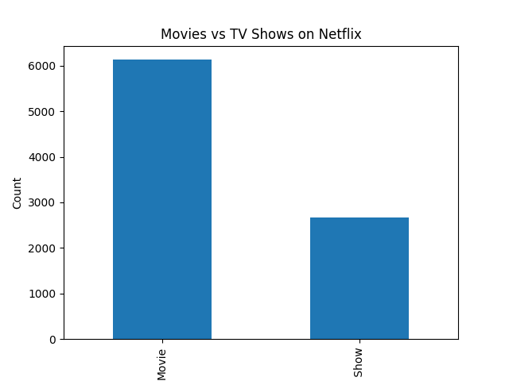
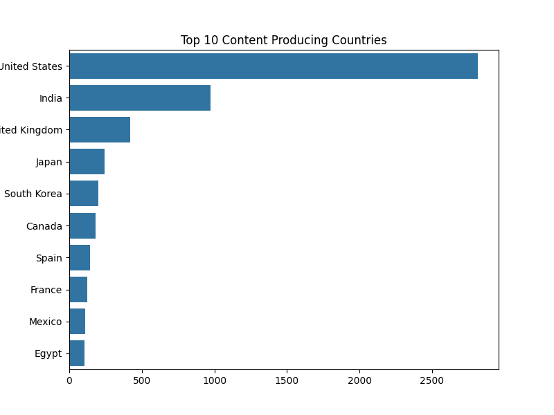
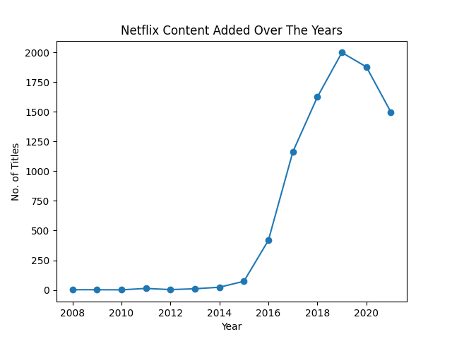
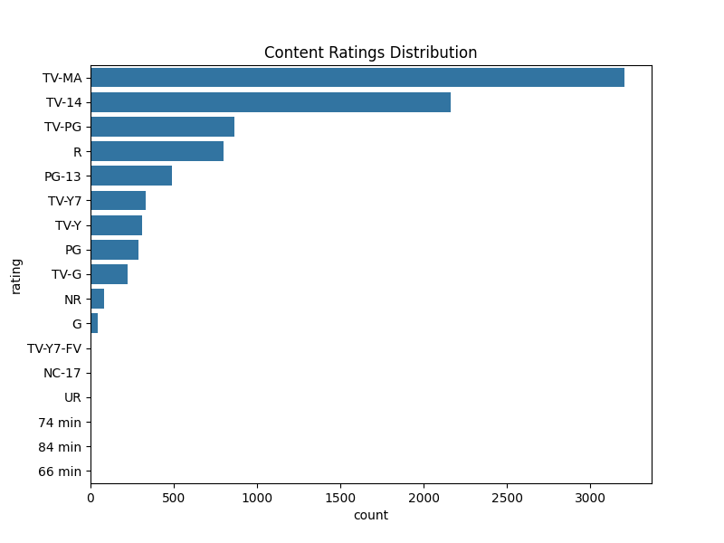
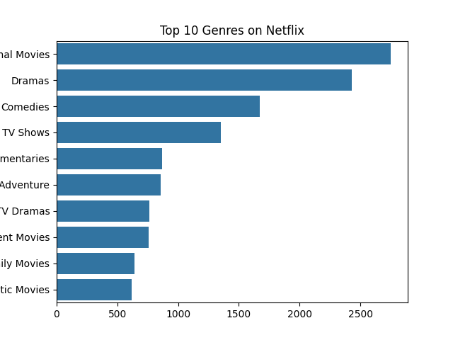

# 🚀 Netflix Data Analytics Project

## 🌐 Overview

This simple project analyzes Netflix movies and TV shows data using Python libraries such as Pandas, Matplotlib, and Seaborn.

The objective of this project is to perform Exploratory Data Analysis (EDA) on Netflix content and uncover insights related to:
- Content distribution
- Top producing countries
- Ratings
- Genres
- Content growth over the years

---

## 📊 Dataset Used

- Dataset: Netflix Movies and TV Shows
- Source: Kaggle
- Link: https://www.kaggle.com/datasets/shivamb/netflix-shows

Dataset includes:
- Movie and TV show titles
- Directors
- Cast members
- Countries
- Ratings
- Genres
- Release years
- Date added to Netflix

---

## 👨‍💼 Technologies Used

- Python
- Pandas
- Matplotlib
- Seaborn
- Jupyter Notebook

---

## 🗒️ Project Structure

```


data/
│
├── netflix_titles.csv
│
notebook/
│
├── analysis.ipynb
│
visuals/
│
├── movies_vs_tvshows.png
├── top_countries.png
├── content_over_years.png
├── ratings_distribution.png
├── top_genres.png

```

---

## 📈 Data Cleaning Performed

The following preprocessing steps were performed:

- Removed duplicate records
- Handled missing values
- Converted date columns into datetime format
- Extracted year information from dates
- Organized genre-related data

---

## 🧪 Analysis Performed

### 1. Movies vs TV Shows

Analyzed the distribution of Movies and TV Shows available on Netflix.

### 2. Top Content Producing Countries

Identified countries producing the highest amount of Netflix content.

### 3. Content Growth Over Years

Analyzed how Netflix content additions changed over time.

### 4. Ratings Distribution

Studied the most common audience ratings available on Netflix.

### 5. Top Genres

Identified the most popular genres on Netflix.

---

## ✍️ Key Insights

- Movies dominate Netflix content compared to TV Shows.
- The United States contributes the highest amount of Netflix content.
- Netflix content growth rapidly increased after 2015.
- Drama and International Movies are among the most popular genres.
- TV-MA is one of the most common content ratings.

---

## 🖼️ Visualizations

### Movies vs TV Shows



---

### Top Countries



---

### Content Over Years



---

### Ratings Distribution



---

### Top Genres



---

## ⭕️ Conclusion

This project demonstrates how Python can be used for:
- Data Cleaning
- Exploratory Data Analysis (EDA)
- Data Visualization
- Insight Generation

The project also highlights practical usage of:
- Pandas for data manipulation
- Matplotlib and Seaborn for visualization
- Jupyter Notebook for interactive analysis

---

## 👨‍💻 Project By

Neil Majumdar
